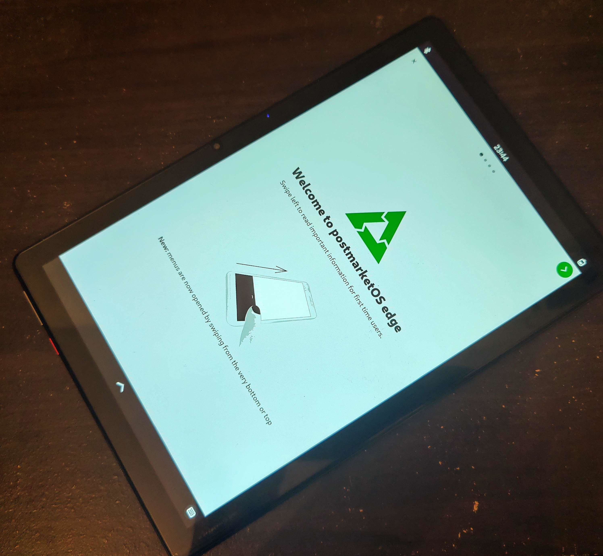

# PostmarketOS for the Chuwi Hi10 Go tablet



This is the port of [PostmarketOS](https://postmarketos.org/) to the 
[Chuwi Hi10 Go](https://www.chuwi.com/product/items/Chuwi-Hi10-Go.html) tablet.
As the device can boot into a mainline Linux kernel, it doesn't make sense to
support it in the [postmarketOS](https://postmarketos.org/) project which
aims to support devices that is unsupported by the upstream Linux kernel and
abandoned by the vendor.

## Device specifications

This is a list of the main hardware components of the device for the 
Chuwi Hi10 Go tablet (CWI513 variant):
- SoC: Intel Celeron N5100
- Dual channel 6GB LPDDR4 RAM from Micron
- SCY E128BS 128GB Flash (eMMC 5.1)
- Realtek RTS5170 SD card reader
- MXC6225 3-axis accelerometer
- Goodix Touchscreen

## Status

The port is based on the mainline Linux kernel 6.2.1. The kernel is configured
with a custom defconfig file, which is based on the defconfig file for Alpine
Linux.

The device is currently in the testing phase. The following things are working:
- Touchscreen
- Wifi
- Bluetooth
- Hardware acceleration / Video playback (VAAPI)
- Microcode updates
- SD card reader

Partially working:
- MXC6225 with the iio-sensor-proxy

The following things are not working:
- Audio

## Installation

You need to have a working Linux installation with the pmbootstrap tool which
has been initialized. You can find the instructions for this in the PostmarketOS
documentation.

Then, you can copy the following folders to your pmbootstrap folder:
```
$ cp -r device-chuwi-hi10go/ /home/sheat/.local/var/pmbootstrap/cache_git/pmaports/device/testing/device-chuwi-hi10go/
$ cp -r linux-chuwi-hi10go/ /home/sheat/.local/var/pmbootstrap/cache_git/pmaports/device/testing/linux-chuwi-hi10go/
```

You can then build a pmOS image for the device like any other device:
```bash
$ pmbootstrap init
[23:33:17] Location of the 'work' path. Multiple chroots (native, device arch, device rootfs) will be created in there.
[...]
[23:33:19] Available (7):
[23:33:19] * edge: Rolling release / Most devices / Occasional breakage: https://postmarketos.org/edge
[23:33:19] * v22.12: Latest release / Recommended for best stability
[23:33:19] * v22.06: Old release (unsupported)
[23:33:19] * v21.12: Old release (unsupported)
[23:33:19] * v21.06: Old release (unsupported)
[23:33:19] * v21.03: Old release (unsupported)
[23:33:19] * v20.05: Old release (unsupported)
[23:33:19] Channel [edge]: 
[23:33:23] Choose your target device vendor (either an existing one, or a new one for porting).
[...]
[23:33:23] Vendor [chuwi]: 
[23:33:28] Available codenames (1): hi10go
[23:33:28] Device codename [hi10go]: 
[23:33:30] Username [user]: 
[...]
# Please note this will take a while
$ pmbootstrap build device-chuwi-hi10go
$ pmbootstrap install
$ pmbootstrap export --sdcard /dev/sdX # Or any other way to flash the image
```
You can then boot the device and log in with the username and password you
specified during the installation. The image can be booted from a USB stick
as well and be flashed to the internal storage. **Please note that the
SD card reader doesn't seems to be supported in the UEFI, so you can't boot
from there.**

Please note that the device is currently in the testing phase, so it is not
recommended to use it as your daily driver. I am not responsible for any
damage to your device. Everything is provided as-is. The port is tested on
my own device, but I can't guarantee that it will work on your device.

## License
This project is licensed under the terms of the MIT license. Feel free to
contribute to this project by forking it and sending pull requests. See
the [LICENSE](LICENSE) file for more information.
